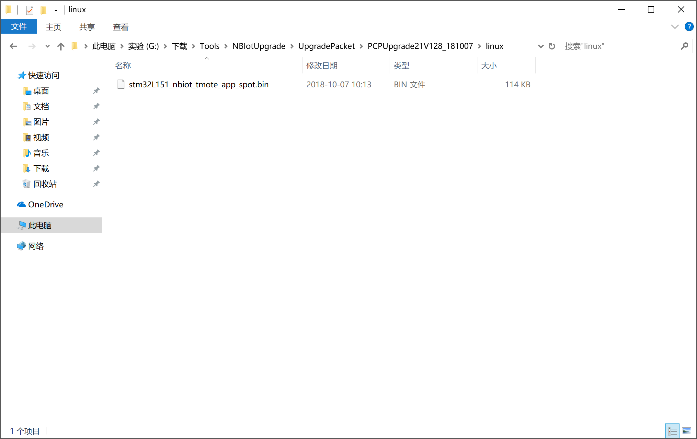
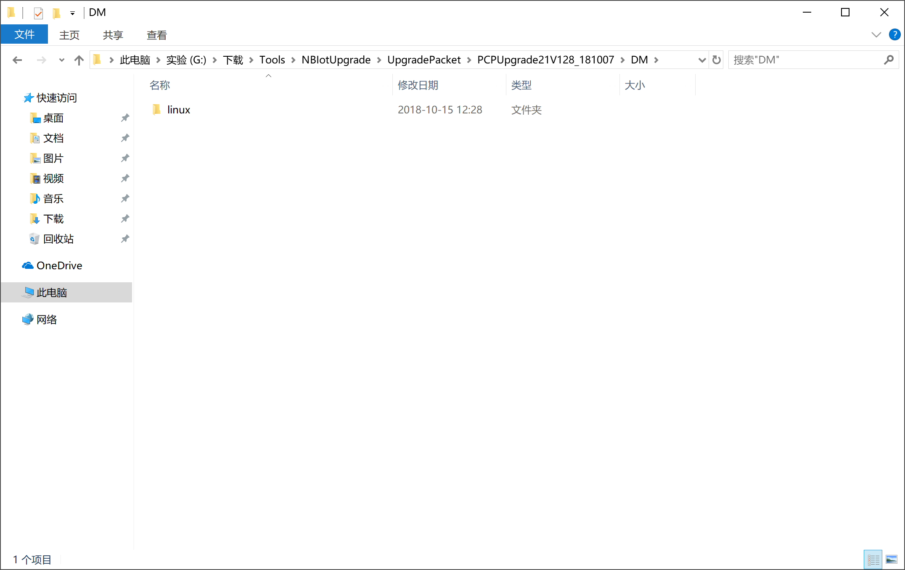
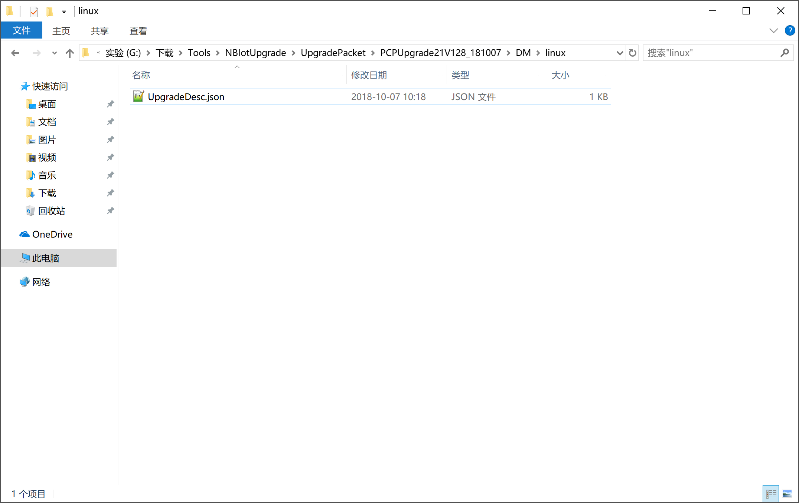
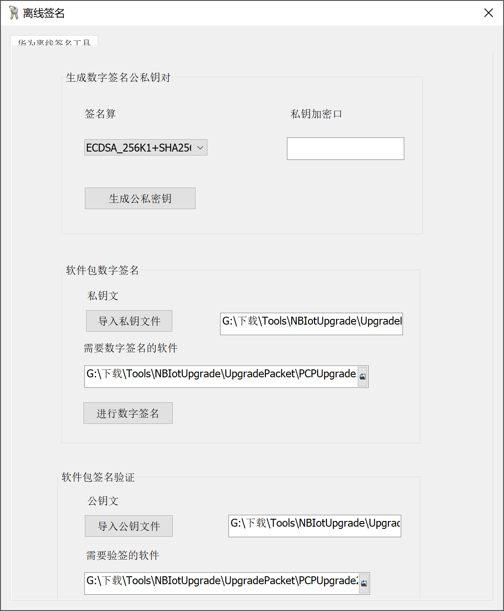

# MVB-VD33D-P2 使用手册 (内部使用) 
## -- 杭州目博科技有限公司 --

> * 此文档为杭州目博内部员工使用手册，不对外发布，具体文档责任追究归杭州目博所有。
> * 研发测试人员需熟知文档，其他人员需会查询文档。
> * 若异常为文档中记录情况质询不予回答。
> * 保密等级 : 最高。

|日期|版本号|作者|更新内容|
|:-----:|:-----:|:-----:|:-----:|
|2018-10-08|V0.0.1|康运杰|初次编写|
|2018-10-15|V0.0.2|康运杰|修订无线下发指令；增加NB指令通过平台下发|
|2018-10-15|V0.0.3|康运杰|增加NBIoT远程PCP升级|

#### < 固件版本: V20.120 ~ V20.128 且向后兼容 >

<!-- TOC -->

- [MVB-VD33D-P2 使用手册 (内部使用)](#mvb-vd33d-p2-使用手册-内部使用)
    - [-- 杭州目博科技有限公司 --](#---杭州目博科技有限公司---)
            - [< 固件版本: V20.120 ~ V20.128 且向后兼容 >](#-固件版本-v20120--v20128-且向后兼容-)
    - [一、小无线调试信息](#一小无线调试信息)
        - [1.启动信息：](#1启动信息)
            - [Ⅰ、<font color="#dd0000"> Device Reboot: <#1> Cause: <#2> Nor: <#3> </font>](#ⅰfont-colordd0000-device-reboot-1-cause-2-nor-3-font)
            - [Ⅱ、<font color="#dd0000"> Copyright (C) 2018 Movebroad Version:<#1>.<#2> </font>](#ⅱfont-colordd0000-copyright-c-2018-movebroad-version12-font)
            - [Ⅲ、<font color="#dd0000"> Entered Up Work </font>](#ⅲfont-colordd0000-entered-up-work-font)
            - [Ⅳ、<font color="#dd0000"> Entering Up Work </font>](#ⅳfont-colordd0000-entering-up-work-font)
        - [2.NBIoT运行信息(CoAP)：](#2nbiot运行信息coap)
            - [Ⅰ、错误码(ECde <#1>)](#ⅰ错误码ecde-1)
            - [Ⅱ、<font color="#dd0000"> NB HDRBT Ok, Baud:<#1> </font>](#ⅱfont-colordd0000-nb-hdrbt-ok-baud1-font)
            - [Ⅲ、<font color="#dd0000"> NB ReportErrorCode Set 1 Ok </font>](#ⅲfont-colordd0000-nb-reporterrorcode-set-1-ok-font)
            - [Ⅳ、<font color="#dd0000"> NB Module Check Ok </font>](#ⅳfont-colordd0000-nb-module-check-ok-font)
            - [Ⅴ、<font color="#dd0000"> NB Parameter Config ... </font>](#ⅴfont-colordd0000-nb-parameter-config--font)
            - [Ⅵ、<font color="#dd0000"> NB ICCID Check Ok </font>](#ⅵfont-colordd0000-nb-iccid-check-ok-font)
            - [Ⅶ、<font color="#dd0000"> CoAP FullFunc Check Ok </font>](#ⅶfont-colordd0000-coap-fullfunc-check-ok-font)
            - [Ⅷ、<font color="#dd0000"> CoAP MinFunc Check Ok </font>](#ⅷfont-colordd0000-coap-minfunc-check-ok-font)
            - [Ⅸ、<font color="#dd0000"> CoAP CDP Read <#1>:<#2> Ok </font>](#ⅸfont-colordd0000-coap-cdp-read-12-ok-font)
            - [Ⅹ、<font color="#dd0000"> CoAP CDP Set <#1>:<#2> Ok </font>](#ⅹfont-colordd0000-coap-cdp-set-12-ok-font)
            - [ⅩⅠ、<font color="#dd0000"> CoAP BAND Read <#1> Ok </font>](#ⅹⅰfont-colordd0000-coap-band-read-1-ok-font)
            - [ⅩⅡ、<font color="#dd0000"> CoAP MiscEquip Read Ok </font>](#ⅹⅱfont-colordd0000-coap-miscequip-read-ok-font)
            - [ⅩⅢ、<font color="#dd0000"> CoAP CGATT <#1> Ok </font>](#ⅹⅲfont-colordd0000-coap-cgatt-1-ok-font)
            - [ⅩⅣ、<font color="#dd0000"> CoAP Parameter Check Ok </font>](#ⅹⅳfont-colordd0000-coap-parameter-check-ok-font)
            - [ⅩⅤ、<font color="#dd0000"> CoAP Send Payload Ok </font>](#ⅹⅴfont-colordd0000-coap-send-payload-ok-font)
            - [ⅩⅥ、<font color="#dd0000"> CoAP Send Ok </font>](#ⅹⅵfont-colordd0000-coap-send-ok-font)
            - [ⅩⅦ、<font color="#dd0000"> CoAP Recv Data Ok </font>](#ⅹⅶfont-colordd0000-coap-recv-data-ok-font)
            - [ⅩⅧ、<font color="#dd0000"> CoAP Wait Send Ok </font>](#ⅹⅷfont-colordd0000-coap-wait-send-ok-font)
            - [ⅩⅨ、<font color="#dd0000"> RSSI:<#1> SNR:<#2> </font>](#ⅹⅸfont-colordd0000-rssi1-snr2-font)
        - [3.NBIoT运行信息(MqttSN)：](#3nbiot运行信息mqttsn)
            - [Ⅰ、错误码(ECde <#1>)](#ⅰ错误码ecde-1-1)
            - [Ⅱ、<font color="#dd0000"> xxx Creat UDP Ok </font>](#ⅱfont-colordd0000-xxx-creat-udp-ok-font)
            - [Ⅲ、<font color="#dd0000"> DNS Analysis <#1> OK </font>](#ⅲfont-colordd0000-dns-analysis-1-ok-font)
            - [Ⅳ、<font color="#dd0000"> xxx Close UDP Ok </font>](#ⅳfont-colordd0000-xxx-close-udp-ok-font)
            - [Ⅴ、<font color="#dd0000"> MqttSN Connect Server Ok </font>](#ⅴfont-colordd0000-mqttsn-connect-server-ok-font)
            - [Ⅵ、<font color="#dd0000"> MqttSN Subscrib <#1> Ok </font>](#ⅵfont-colordd0000-mqttsn-subscrib-1-ok-font)
            - [Ⅶ、<font color="#dd0000"> MqttSN Send Payload Ok </font>](#ⅶfont-colordd0000-mqttsn-send-payload-ok-font)
            - [Ⅷ、<font color="#dd0000"> MqttSN DisConnect Ok </font>](#ⅷfont-colordd0000-mqttsn-disconnect-ok-font)
            - [Ⅸ、<font color="#dd0000"> MqttSN Recv Filter:<#1>, topicid:<#2> </font>](#ⅸfont-colordd0000-mqttsn-recv-filter1-topicid2-font)
            - [Ⅹ、<font color="#dd0000"> MqttSN Recv Payload:<#1> </font>](#ⅹfont-colordd0000-mqttsn-recv-payload1-font)
    - [二、小无线命令下发指令](#二小无线命令下发指令)
        - [1.重启设备：](#1重启设备)
        - [2.设置新的设备号（SN号）：](#2设置新的设备号sn号)
        - [3.设置NB模组CDP地址：](#3设置nb模组cdp地址)
        - [4.设置设备工作状态：](#4设置设备工作状态)
        - [5.雷达调试值：(已去除)](#5雷达调试值已去除)
        - [6.地磁模式:](#6地磁模式)
        - [7.NBIoT心跳包间隔值:](#7nbiot心跳包间隔值)
        - [8.RadarRange:](#8radarrange)
        - [9.地磁初始化:](#9地磁初始化)
        - [10.车辆进入间隔时间发送状态数据:](#10车辆进入间隔时间发送状态数据)
        - [11.小无线调试模式输出调试信息等级:](#11小无线调试模式输出调试信息等级)
        - [12.NB模组间隔时间发送不带RA数据包:](#12nb模组间隔时间发送不带ra数据包)
        - [13.地磁温飘值:](#13地磁温飘值)
        - [14.自动设置地磁温飘值:](#14自动设置地磁温飘值)
        - [15.蜂鸣器工作使能:](#15蜂鸣器工作使能)
        - [16.设定PCP升级限制信号值与信噪比:](#16设定pcp升级限制信号值与信噪比)
        - [17.恢复出厂参数:](#17恢复出厂参数)
        - [18.发送workinfo:](#18发送workinfo)
        - [19.发送netinfo:](#19发送netinfo)
        - [20.发送devinfo:](#20发送devinfo)
        - [21.发送upgradeinfo:](#21发送upgradeinfo)
    - [三、NBIoT指令下发](#三nbiot指令下发)
        - [1.指令下发平台:](#1指令下发平台)
        - [2.操作步骤:](#2操作步骤)
        - [3.指令详情:](#3指令详情)
    - [四、NBIoT远程PCP升级](#四nbiot远程pcp升级)
        - [1.PCP远程升级平台:](#1pcp远程升级平台)
        - [2.操作步骤:](#2操作步骤-1)
    - [五、NBIoT上报平台数据解析](#五nbiot上报平台数据解析)
        - [1.WorkInfo:](#1workinfo)
        - [2.BasicInfo:](#2basicinfo)
        - [3.DynamicInfo:](#3dynamicinfo)
    - [六、设备异常分析](#六设备异常分析)
        - [1.设备运行异常，处理器运行不起来，30秒左右重启设备，且会进入Boot模式出不来。](#1设备运行异常处理器运行不起来30秒左右重启设备且会进入boot模式出不来)
        - [2.小无线打印ICCID Error。](#2小无线打印iccid-error)
    - [Copyright (C) 2018 Movebroad Version: 0.0.3](#copyright-c-2018-movebroad-version-003)

<!-- /TOC -->

## 一、小无线调试信息
> * 工作模式 : Config(配置器选择工作模式为调试模式并对设备列表中指定设备发送命令)。
> * 调试等级 : 默认2（配置器下发命令"rfdplv:2"配置其调试等级）。

### 1.启动信息：
#### Ⅰ、<font color="#dd0000"> Device Reboot: <#1> Cause: <#2> Nor: <#3> </font>
* #1 : 设备重启次数，至设备出厂一共重启次数(unsigned int)
* #2 : 设备重启方式:
	* RCC_RESET_FLAG_NONE = 0x00 /*!< None Reset Flag */
	* RCC_RESET_FLAG_IWDGRST = 0x01 /*!< Independent Watchdog Reset Flag */
	* RCC_RESET_FLAG_SFTRST = 0x02 /*!< Software Reset Flag */
	* RCC_RESET_FLAG_PORRST = 0x04 /*!< POR/PDR Reset Flag */
	* RCC_RESET_FLAG_PINRST = 0x08 /*!< PIN Reset Flag */
	* RCC_RESET_FLAG_LPWRRST = 0x03 /*!< Low-Power Reset Flag */
	* RCC_RESET_FLAG_OBLRST = 0x05 /*!< Options Bytes Loading Reset Flag */
	* RCC_RESET_FLAG_WWDGRST = 0x07 /*!< Window Watchdog Reset Flag */
* #3 : SPIFLASH是否正常或使用:
	* None 无SpiFLash或异常。
	* Ok 有SpiFlash且正常。

#### Ⅱ、<font color="#dd0000"> Copyright (C) 2018 Movebroad Version:<#1>.<#2> </font>
* #1 : 主软件版本号。
	* 20 : CoAP协议设备。
	* 21 : MqttSN协议设备。
	* 22 : OneNET协议设备。
* #2 : 次软件版本号。

#### Ⅲ、<font color="#dd0000"> Entered Up Work </font>
* 以进入工作状态，设备翻转激活成功打印。

#### Ⅳ、<font color="#dd0000"> Entering Up Work </font>
* 设备正在翻转激活中。

### 2.NBIoT运行信息(CoAP)：
#### Ⅰ、错误码(ECde <#1>)
* #1 : 指令执行出错错误码:
	* NBIOT_ERROR = 0x01
	* NBIOT_CMD_TIMEOUT = 0x02
	* Uplink_Busy_Flow_Control = 159
	* TUP_not_registered = 513
	* Other ： 详询。

#### Ⅱ、<font color="#dd0000"> NB HDRBT Ok, Baud:<#1> </font>
* #1 : NBIoT模组与MCU之间通行波特率。

#### Ⅲ、<font color="#dd0000"> NB ReportErrorCode Set 1 Ok </font>
* 使能NBIoT模组输出错误码。

#### Ⅳ、<font color="#dd0000"> NB Module Check Ok </font>
* 模组信息检查。

#### Ⅴ、<font color="#dd0000"> NB Parameter Config ... </font>
* 模组参数配置。

#### Ⅵ、<font color="#dd0000"> NB ICCID Check Ok </font>
* Sim卡检查。

#### Ⅶ、<font color="#dd0000"> CoAP FullFunc Check Ok </font>
* 模组全功能开启检查。

#### Ⅷ、<font color="#dd0000"> CoAP MinFunc Check Ok </font>
* 模组最小功能开启检查。

#### Ⅸ、<font color="#dd0000"> CoAP CDP Read <#1>:<#2> Ok </font>
* CDP服务器读取。
* #1 CDP IP Server。
* #2 CDP Port Server。

#### Ⅹ、<font color="#dd0000"> CoAP CDP Set <#1>:<#2> Ok </font>
* CDP服务器设置。
* #1 CDP IP Server。
* #2 CDP Port Server。

#### ⅩⅠ、<font color="#dd0000"> CoAP BAND Read <#1> Ok </font>
* BAND 模式读取。
* #1 模组工作频段:
	* NBand_2100MHz						= 1,(未知)
	* NBand_1800MHz						= 3,(联通)
	* NBand_850MHz						= 5,(电信)
	* NBand_900MHz						= 8,(移动)
	* NBand_800MHz						= 20,(联通)
    * NBand_700MHz						= 28(未知)

#### ⅩⅡ、<font color="#dd0000"> CoAP MiscEquip Read Ok </font>
* 其他参数配置，异常详询。

#### ⅩⅢ、<font color="#dd0000"> CoAP CGATT <#1> Ok </font>
* 注网检查。
* #1 注网查询值:
	* 0 还未注网成功。
	* 1 注网成功。

#### ⅩⅣ、<font color="#dd0000"> CoAP Parameter Check Ok </font>
* 模组参数检出，包括信号和基站时间等信息。

#### ⅩⅤ、<font color="#dd0000"> CoAP Send Payload Ok </font>
* 数据发送指令执行成功。

#### ⅩⅥ、<font color="#dd0000"> CoAP Send Ok </font>
* 数据成功发送到指定平台。

#### ⅩⅦ、<font color="#dd0000"> CoAP Recv Data Ok </font>
* 接收到下行数据。

#### ⅩⅧ、<font color="#dd0000"> CoAP Wait Send Ok </font>
* 等待模组将数据发送至平台，具体等待时间视信号而定。

#### ⅩⅨ、<font color="#dd0000"> RSSI:<#1> SNR:<#2> </font>
* #1 模组信号值 需18以上，过低或经常跳变，需上报做异常处理。（过低为低于15）
* #2 模组信噪比 需30以上，过低，需上报做异常处理。 （过低为低于-60）

### 3.NBIoT运行信息(MqttSN)：
#### Ⅰ、错误码(ECde <#1>)
* #1 : 指令执行出错错误码:
	* 同上。

#### Ⅱ、<font color="#dd0000"> xxx Creat UDP Ok </font>
* UDP Socket创建成功。

#### Ⅲ、<font color="#dd0000"> DNS Analysis <#1> OK </font>
* DNS解析域名成功。
* #1 解析该域名。

#### Ⅳ、<font color="#dd0000"> xxx Close UDP Ok </font>
* UDP Socket关闭成功。

#### Ⅴ、<font color="#dd0000"> MqttSN Connect Server Ok </font>
* 设备连接至MqttSN服务器。

#### Ⅵ、<font color="#dd0000"> MqttSN Subscrib <#1> Ok </font>
* 设备订阅MqttSN主题成功。
* #1 订阅主题名称(与设备号相同)

#### Ⅶ、<font color="#dd0000"> MqttSN Send Payload Ok </font>
* 设备发送数据到MqttSN服务器，标识数据已发送到MqttSN服务器且成功。

#### Ⅷ、<font color="#dd0000"> MqttSN DisConnect Ok </font>
* 设备发送Disconnect到MqttSN服务器，设备进入Sleep模式。

#### Ⅸ、<font color="#dd0000"> MqttSN Recv Filter:<#1>, topicid:<#2> </font>
* 设备收到MqttSN服务器发送的下行数据。
* #1 下行数据主题名称。
* #2 下行数据主题ID。

#### Ⅹ、<font color="#dd0000"> MqttSN Recv Payload:<#1> </font>
* #1 下行数据数据长度。

## 二、小无线命令下发指令
> * 指令需通过配置器下发，命令通过车位检测上位机发送。
> * 指令发送前关闭串口，写入命令，选择设备，先点击设置命令锁存命令，开启串口，选择设备，再次点击设置命令发送。

### 1.重启设备：
* <font color="#dd00dd"> reboot </font>

### 2.设置新的设备号（SN号）：
* <font color="#dd00dd"> newsn:<#1> </font>
* #1 8位16进制，4字节数据。

### 3.设置NB模组CDP地址：
* <font color="#dd00dd"> ip<#1>:<#2> </font>
* #1 IP 8位16进制，4字节数据。
* #2 PORT 10进制端口值。

### 4.设置设备工作状态：
* <font color="#dd00dd"> active:<#1> </font>
* #1 工作状态值:
	* 0 未激活
	* 1 激活

### 5.雷达调试值：(已去除)
* <font color="#dd00dd"> radardbg:<#1> </font>
* #1 雷达调试值，16进制2字节值。

### 6.地磁模式:
* <font color="#dd00dd"> magmod:<#1> </font>
* #1 地磁模式值，16进制2字节值。

### 7.NBIoT心跳包间隔值:
* <font color="#dd00dd"> nbheart:<#1> </font>
* #1 NB心跳包间隔时间。

### 8.RadarRange:
* <font color="#dd00dd"> disrange:<#1> </font>
* #1 16进制2字节值。

### 9.地磁初始化:
* <font color="#dd00dd"> maginit </font>
* 初始化地磁传感器背景值。

### 10.车辆进入间隔时间发送状态数据:
* <font color="#dd00dd"> indelay:<#1> </font>
* #1 16进制2字节值。

### 11.小无线调试模式输出调试信息等级:
* <font color="#dd00dd"> rfdplv:<#1> </font>
* #1 调试等级:
	* 0								//调试信息不打印
	* 1								//基本信息打印
	* 2								//NB信息打印
	* 3								//所有信息打印

### 12.NB模组间隔时间发送不带RA数据包:
* <font color="#dd00dd"> ratime:<#1> </font>
* #1 CoAP间隔时间发送普通数据包。

### 13.地磁温飘值:
* <font color="#dd00dd"> coef:%hd,%hd,%hd </font>

### 14.自动设置地磁温飘值:
* <font color="#dd00dd"> SetQmcCoef </font>

### 15.蜂鸣器工作使能:
* <font color="#dd00dd"> beepoff:%hu </font>

### 16.设定PCP升级限制信号值与信噪比:
* <font color="#dd00dd"> uplimit:<#1>,<#2> </font>
* #1 Rssi
* #2 Snr

### 17.恢复出厂参数:
* <font color="#dd00dd"> restore </font>

### 18.发送workinfo:
* <font color="#dd00dd"> workinfo </font>
* 小无线打印workinfo信息，NB发送workinfo包。
```c
	Radio_Trf_Printf("Soft:%d:%d.%d", TCFG_EEPROM_GetBootVersion(), TCFG_Utility_Get_Major_Softnumber(), TCFG_Utility_Get_Sub_Softnumber());
	Radio_Trf_Printf("Sense:%d", TCFG_EEPROM_GetSavedSensitivity());
	Radio_Trf_Printf("Mode:%s", TCFG_EEPROM_Get_WorkMode_String());
	Radio_Trf_Printf("Channel:%d", TCFG_EEPROM_GetRfChannel());
	Radio_Trf_Printf("Range:%d", TCFG_Utility_Get_DistanceRange());
	Radio_Trf_Printf("Earfcn:%d", TCFG_Utility_Get_Nbiot_RadioEARFCN());
	Radio_Trf_Printf("Tac:%X", TCFG_Utility_Get_Nbiot_NetworkRegStatusTac());
	Radio_Trf_Printf("Ci:%X", TCFG_Utility_Get_Nbiot_NetworkRegStatusCellID());
	Radio_Trf_Printf("Cmdcnt:%d.%d", TCFG_EEPROM_GetRFCmdCnt(), TCFG_EEPROM_GetNBCmdCnt());
	Radio_Trf_Printf("Nbruntime:%d.%d", TCFG_Utility_GetCoapConnectTime(), TCFG_Utility_GetCoapIdleTime());
	Radio_Trf_Printf("Coef:%d.%d.%d", TCFG_SystemData.MagCoefX, TCFG_SystemData.MagCoefY, TCFG_SystemData.MagCoefZ);
```

### 19.发送netinfo:
* <font color="#dd00dd"> netinfo </font>
* 小无线打印netinfo信息，NB发送Tmoteinfo包。
```c
	Radio_Trf_Printf("Muftur:%s", NbiotClientHandler.Parameter.manufacturer);
	Radio_Trf_Printf("MufturMd:%s", NbiotClientHandler.Parameter.manufacturermode);
	Radio_Trf_Printf("MduVer:%s", NbiotClientHandler.Parameter.modelversion);
	Radio_Trf_Printf("IMEI:%s", NbiotClientHandler.Parameter.imei);
	Radio_Trf_Printf("ICCID:%s", NbiotClientHandler.Parameter.iccid);
	Radio_Trf_Printf("IMSI:%s", NbiotClientHandler.Parameter.imsi);
	Radio_Trf_Printf("CGP:%s", NbiotClientHandler.Parameter.cgpaddr);
	Radio_Trf_Printf("PDPType:%s", NbiotClientHandler.Parameter.cgdcontPDPType);
	Radio_Trf_Printf("APN:%s", NbiotClientHandler.Parameter.cgdcontAPN);
	Radio_Trf_Printf("RSSI:%d", NbiotClientHandler.Parameter.rssi);
	Radio_Trf_Printf("SNR:%d", NbiotClientHandler.Parameter.statisticsRADIO.SNR);
	Radio_Trf_Printf("CDPHost:%s", NbiotClientHandler.Parameter.cdpserver.CDPServerHost);
	Radio_Trf_Printf("CDPPort:%d", NbiotClientHandler.Parameter.cdpserver.CDPServerPort);
	Radio_Trf_Printf("MqttSN :%s", MQTTSN_SERVER_HOST_NAME);
	Radio_Trf_Printf("MqttSN :%s:%d", MqttSNClientHandler.SocketStack->ServerHost, MqttSNClientHandler.SocketStack->ServerPort);
```

### 20.发送devinfo:
* <font color="#dd00dd"> devinfo </font>
* 小无线打印deviceinfo信息。
```c
	Radio_Trf_Printf("Runtime:%d", TCFG_Utility_Get_Run_Time());
	Radio_Trf_Printf("Batt:%d", TCFG_Utility_Get_Device_Batt_ShortVal());
	Radio_Trf_Printf("RdLib:%d", TCFG_Utility_Get_RadarLibNum());
	Radio_Trf_Printf("RdCnt:%d", TCFG_GetRadarCount());
	Radio_Trf_Printf("MCUTemp:%d", TCFG_Utility_Get_Device_Temperature());
	Radio_Trf_Printf("AlgoLib:%d", TCFG_Utility_Get_AlgoLibNum());
	Radio_Trf_Printf("QmcReboot:%d", TCFG_Utility_Get_ReInitModuleCount());
	Radio_Trf_Printf("Nbboot:%d", TCFG_Utility_Get_Nbiot_BootCount());
	Radio_Trf_Printf("Nbsent:%d", TCFG_Utility_Get_Nbiot_SentCount());
	Radio_Trf_Printf("Nbrecv:%d", TCFG_Utility_Get_Nbiot_RecvCount());
```

### 21.发送upgradeinfo:
* <font color="#dd00dd"> upgradeinfo </font>
* 小无线答应upgradeinfo信息。
```c
	Radio_Trf_Printf("APP1 Status: %02X", APP1Info.Status);
	Radio_Trf_Printf("APP1 BaseAddr: %08X", APP1Info.BaseAddr);
	Radio_Trf_Printf("APP1 BlockNum: %d", APP1Info.BlockNum);
	Radio_Trf_Printf("APP1 BlockLen: %d", APP1Info.BlockLen);
	Radio_Trf_Printf("APP1 DataLen: %d", APP1Info.DataLen);
	Radio_Trf_Printf("APP1 SoftVer: V%d.%d", APP1Info.SoftVer>>16, APP1Info.SoftVer&0xFFFF);
	Radio_Trf_Printf("APP1 CheckCode: %X", APP1Info.CheckCode);
	Radio_Trf_Printf("APP2 Status: %02X", APP2Info.Status);
	Radio_Trf_Printf("APP2 BaseAddr: %08X", APP2Info.BaseAddr);
	Radio_Trf_Printf("APP2 BlockNum: %d", APP2Info.BlockNum);
	Radio_Trf_Printf("APP2 BlockLen: %d", APP2Info.BlockLen);
	Radio_Trf_Printf("APP2 DataLen: %d", APP2Info.DataLen);
	Radio_Trf_Printf("APP2 SoftVer: V%d.%d", APP2Info.SoftVer>>16, APP2Info.SoftVer&0xFFFF);
	Radio_Trf_Printf("APP2 CheckCode: %X", APP2Info.CheckCode);
```

## 三、NBIoT指令下发
> * NBIoT命令下发与小无线命令基本兼容。
> * NBIOT命令下发不得随意操作。

### 1.指令下发平台:
* http://47.106.208.19:3000/#/command

* 

### 2.操作步骤:
* 2.1选择任务管理->远程控制。
* 2.2选择设备通信协议 CoAP(电信平台设备) MQTT(移动设备)。
* 2.3点击 +(加号) 创建远程控制命令。
* 2.4创建命令(CoAP):
	* 
	* 2.4.1输入SN号。
	* 2.4.2选择应用，该应用为电信平台设备号对应profile应用，不得选择错误应用。
	* 2.4.3填入命令超时时间，根据所需命令情况填入时间，命令在设备上发数据是下发给设备。
	* 2.4.4激活设备4小时上发一包心跳包，未激活设备24小时上发一包信息包。
	* 2.4.5命令超时时间 : 一般命令4小时以上，激活设备命令24小时以上
	* 2.4.6基本命令勾选自动选择，并点击选择已有命令下发。
	* 2.4.5最后点击Submit创建命令成功。
* 2.5创建命令(MQTT):
	* 
	* 2.5.1输入SN号。
	* 2.5.2基本命令勾选自动选择，并点击选择已有命令下发。
	* 2.5.3最后点击确定创建命令成功。
* 2.6查看命令是否下发成功:
	* 2.6.1CoAP:
		* DELIVERED : 下发成功。
		* EXPIRED : 下发失败。
		* PENDING : 正在等待下发。
	* 2.6.2MQTT:
		* 100 : 下发成功。
		* FALL ： 下发失败。
		* 102 : 命令错误。
		* PENDING :  正在等待下发。

### 3.指令详情:
* 3.1 Workmode:
	* TCLD110S{(Workmode):{(val):%hu,(Magic):%hu}}
		* 工作模式配置
		* val : 
			* 0 ---> NORMAL_WORK
			* 1 ---> DEBUG_WORK
		* Magic : 9

* 3.2 Sense:
	* TCLD110S{(Sense):{(val):%hu,(Magic):%hu}}
		* 传感器灵敏度配置
		* val :
			* 1 ---> SENSE_HIGHEST
			* 2 ---> SENSE_HIGH
			* 3 ---> SENSE_MIDDLE
			* 4 ---> SENSE_LOW
			* 5 ---> SENSE_LOWEST
		* Magic : 9

* 3.3 RFHeart:
	* TCLD110S{(RFHeart):{(val):%hu,(Magic):%hu}}
		* 无线心跳间隔时间配置
		* val :
			* 1 ~ 120 (秒)
		* Magic : 9

* 3.4 Background:
	* TCLD110S{(Background):{(val):%hu,(Magic):%hu}}
		* 初始化传感器指令
		* val :
			* 背景值
		* Magic : 9

* 3.5 Reboot
	* TCLD110S{(Reboot):{}}
		* 重启设备

* 3.6 Newsn
	* TCLD110S{(Newsn):{(val):%08x,(Magic):%hu}}
		* 设置新SN

* 3.7 Server
	* TCLD110S{(Server):{(IP):(%hu.%hu.%hu.%hu),(Port):%hu,(Magic):%hu}}
		* 设置核心网地址

* 3.8 Active
	* TCLD110S{(Active):{(val):%hu,(Magic):%hu}}
		* 设置设备工作状态
		* val :
			0 ---> 休眠
			1 ---> 激活
		* Magic : 9

* 3.9 MagMod
	* TCLD110S{(MagMod):{(val):%hu,(Magic):%hu}}
		* 设置地磁模式
	
* 3.10 NbHeart
	* TCLD110S{(NbHeart):{(val):%hu,(Magic):%hu}}
		* 状态心跳包间隔时间

* 3.12 InitRadar
	* TCLD110S{(InitRadar):{(v23456):%u,(v7890a):%u,(vbcdef):%u,(vg):%u,(Magic):%hu}}
		* 初始化雷达

* 3.13 InitMag
	* TCLD110S{(InitMag):{(x):%hd,(y):%hd,(z):%hd,(Magic):%hu}}
		* 初始化地磁

* 3.14 DisRange
	* TCLD110S{(DisRange):{(val):%hu,(Magic):%hu}}

* 3.15 InDelay
	* TCLD110S{(InDelay):{(val):%hu,(Magic):%hu}}
		* 间隔时间发送检测有车数据

* 3.16 RATime
	* TCLD110S{(RATime):{(val):%hu,(Magic):%hu}}
		* 间隔时间发送普通数据包用于接收下行数据

* 3.17 MagCoef
	* TCLD110S{(MagCoef):{(x):%hd,(y):%hd,(z):%hd,(Magic):%hu}}
		* 地磁温飘设置

* 3.18 SetQmcCoef
	* TCLD110S{(SetQmcCoef):{}}
		* 自动设置地磁温飘

* 3.19 BeepOff
	* TCLD110S{(BeepOff):{(val):%hu,(Magic):%hu}}
		* 蜂鸣器控制

* 3.20 UpLimit
	* TCLD110S{(UpLimit):{%hd,%hd,(Magic):%hu}}
		* 升级限制 rssi,snr

* 3.21 Workinfo
	* TCLD110G{(Workinfo):{}}
		* 获取Workinfo

* 3.22 BasicInfo
	* TCLD110G{(BasicInfo):{}}
		* 获取BasicInfo
	
* 3.33 DynamicInfo
	* TCLD110G{(DynamicInfo):{}}
		* 获取DynamicInfo

## 四、NBIoT远程PCP升级
> * NBIoT远程PCP升级操作，需使用向上申请。
> * NBIoT远程PCP升级不得随意操作！

### 1.PCP远程升级平台:
* 电信 : https://180.101.146.80:8843/main.html#/login
* 

* 移动 : http://47.106.208.19:3000/#/task/upgrade
* 

* 工具 : \\\192.168.1.10\MVB-Server\temp\康康\Tools
* 

### 2.操作步骤:
* 2.1电信:
	> 如需只创建升级任务，不上传升级包，请直接调转 <font color="#dd0000"> 2.1.4 创建升级任务 </font>
	* 2.1.1 创建升级固件包:
		* 2.1.1.1 新建升级包文件夹 (例 PCPUpgrade20V127_180918)
		* 2.1.1.2 在升级包文件夹中创建 DM , linux 两个文件夹:
		* 
		* 2.1.1.3 在linux文件夹中放入升级包固件 <font color="#dd0000"> (bin文件) </font>:
		* 
		* 2.1.1.4 在DM文件夹中创建linux文件夹:
		* 
		* 2.1.1.5 在DM文件夹下的linux文件夹中创建 <font color="#dd0000"> UpgradeDesc.json </font> 文件:
		* 
		* 2.1.1.6 UpgradeDesc.json 文件内容 例:
			* ```c
				{
					"specVersion":"1.0",
					"fileName":"stm32L151_nbiot_tmote_app_spot.bin",
					"version":"V20.127",
					"versionCheckCode":"e1",
					"deviceType":"VehicleDetectorNoRsp2",
					"manufacturerName":"movebroadNoRsp2",
					"model":"6203",
					"packageType":"softwarePackage",
					"protocolType":"CoAP",
					"date":"2018-09-18",
					"description":"Movebroad test software package"
				}
			* specVersion 升级协议 <font color="#dd0000"> 默认 1.0 </font>
			* fileName 升级包固件名 <font color="#dd0000"> 该固件名需同2.1.1.3中放入固件同名 </font>
			* version 升级包固件版本号 <font color="#dd0000"> 该固件版本号格式需同例子相同 V主版本号.次版本号 </font>
			* versionCheckCode 升级包校验码 <font color="#dd0000"> 该校验码字母小写,获取方式根据2.1.1.7 </font>
			* deviceType 设备类型 <font color="#dd0000"> 查看电信平台，根据设备具体信息填写 </font>
			* manufacturerName 厂商名称 <font color="#dd0000"> 查看电信平台，根据设备具体信息填写 </font>
			* model 插件版本 <font color="#dd0000"> 查看电信平台，根据设备具体信息填写 </font>
			* packageType 包类型 <font color="#dd0000"> 查看电信平台，根据设备具体信息填写 </font>
			* protocolType 通信协议 <font color="#dd0000"> 查看电信平台，根据设备具体信息填写 </font>
			* date 升级包创建日期
			* description 批注
		* 2.1.1.7 <font color="#dd0000"> versionCheckCode </font> 值获取:
			* 检验码获取工具在 <font color="#dd0000"> 工具 </font> 目录CheckFile文件夹中:
				* 
				* CheckFile.exe为校验码获取工具。
				* CheckFile.c为工具源码。
			* 检验码获取工具使用:
				* 1. 将升级包固件 <font color="#dd0000"> bin文件 </font> 放在与CheckFile.exe同目录下。
				* 2. 双击打开CheckFile.exe工具，输入需校验的固件包名:
				* 
				* 3. 回车获取校验码:
				* 
		* 2.1.1.8 将DM,linux文件夹打包为zip文件 <font color="#dd0000"> package.zip </font>
		* 
		* 2.1.1.9 加密升级包:
			* 打开工具路径下的 Tools\NBIotUpgrade\signtool\signtool 文件夹。
			* 
			* 双击打开华为离线签名工具 signtool.exe
			* 
			* 签名算法为 ECDSA_256 私钥加密填写 135246Acbd* 点击生成公私密钥，并存放到升级包文件夹下。
			* 
			* 
			* 点击导入私钥文件 private.pem 填写私钥密码，选择需要加密的软件包 package.zip
			* 
			* 点击进行数字签名，生成加密软件包 package_signed.zip
			* 
			* 软件包签名验证:
				* 1. 点击导入公钥文件 public.pem。
				* 2. 选择需验证加密软件包 package_signed.zip。
				* 3. 点击验证。
				* 4. 
	* 2.1.2 上传公钥到电信平台:
		* 2.1.2.1 选择对应profile应用，点击包管理中的公钥管理。
		* 
		* 2.1.2.2 点击上传，选择公钥 public.pem，选择对应的厂商名称,点击保存。
		* 
	* 2.1.3 上传软件包到电信平台:
		* 2.1.3.1 选择对应profile应用，点击包管理中的软件包管理。
		* 
		* 2.1.3.2 点击添加软件包，点击上传文件，选择对应软件包 package_signed.zip。
		* 
		* 2.1.3.3 软件包上传成功可查看对应软件包信息，确认信息是否有误。
	* 2.1.4 创建升级任务:
		* 选择需升级设备，点击其SN号进入设备详情，点击软件，查看设备软件版本。
		* 
		* 点击软件升级，填写升级信息:
		* 
			* 1. 任务名不得重复，需注明升级人员。
			* 2. 使用策略。
			* 3. 执行类型:设备在线时。
			* 4. 重试策略:自定义。
			* 5. 重试次数:视情况而定。
			* 6. 重试间隔:视情况而定，默认2。
			* 7. APP确认:否。
			* 8. 软件包选择，选择需升级的固件包。
	* 2.1.5 查看升级进度:
		* 点击操作记录，选择软件包升级记录，查看目前升级进度。
	* 2.1.6 升级注意事项:
		* 2.1.6.1 升级任务创建成功后可在电信平台查看升级进度。
		* 2.1.6.2 升级任务启动需在设备发送一包普通数据包开启，可触发设备发送一包普通数据包。
		* 2.1.6.3 设备升级过程中可能会应网络通信断连，导致升级中断，可继续创建升级任务，升级。
		* 2.1.6.4 设备具有断点续传功能，可继续下在为下载的升级分片包，请不要在上次未完成升级的设备让它升级不同固件包。
		* 2.1.6.5 如果测试设备升级时，设备应信号较弱，主动停止升级，可通过配置器向设备发送命令 uplimit:5,-80 降低升级限制rssi，snr，具体细节查看配置器下发命令章节。
		* 2.1.6.6 如遇其他升级异常情况，或多次建立升级任务失败，请及时反馈开发人员。

* 2.2移动:
	> 如需只创建升级任务，不上传升级包，请直接调转 <font color="#dd0000"> 2.2.3 创建升级任务 </font>
	* 2.2.1 创建升级固件包:
		* 2.2.1.1 新建升级包文件夹 (例 PCPUpgrade21V128_181007)
		* 2.2.1.2 在升级包文件夹中创建 DM , linux 两个文件夹:
		* 
		* 2.2.1.3 在linux文件夹中放入升级包固件 <font color="#dd0000"> (bin文件) </font>:
		* 
		* 2.2.1.4 在DM文件夹中创建linux文件夹:
		* 
		* 2.2.1.5 在DM文件夹下的linux文件夹中创建 <font color="#dd0000"> UpgradeDesc.json </font> 文件:
		* 
		* 2.2.1.6 UpgradeDesc.json 文件内容 例:
			* ```c
				{
					"specVersion":"1.0",
					"fileName":"stm32L151_nbiot_tmote_app_spot.bin",
					"version":"V21.128",
					"versionCheckCode":"c2",
					"deviceType":"VehicleDetectorNoRsp2",
					"manufacturerName":"movebroadNoRsp2",
					"model":"6203",
					"packageType":"softwarePackage",
					"protocolType":"CoAP",
					"date":"2018-10-07",
					"description":"Movebroad test software package"
				}
			* specVersion 升级协议 <font color="#dd0000"> 默认 1.0 </font>
			* fileName 升级包固件名 <font color="#dd0000"> 该固件名需同2.2.1.3中放入固件同名 </font>
			* version 升级包固件版本号 <font color="#dd0000"> 该固件版本号格式需同例子相同 V主版本号.次版本号 </font>
			* versionCheckCode 升级包校验码 <font color="#dd0000"> 该校验码字母小写,获取方式根据2.2.1.7 </font>
			* deviceType 设备类型 <font color="#dd0000"> 默认 </font>
			* manufacturerName 厂商名称 <font color="#dd0000"> 默认 </font>
			* model 插件版本 <font color="#dd0000"> 默认 </font>
			* packageType 包类型 <font color="#dd0000"> 默认 </font>
			* protocolType 通信协议 <font color="#dd0000"> 默认 </font>
			* date 升级包创建日期
			* description 批注
		* 2.2.1.7 <font color="#dd0000"> versionCheckCode </font> 值获取:
			* 检验码获取工具在 <font color="#dd0000"> 工具 </font> 目录CheckFile文件夹中:
				* 
				* CheckFile.exe为校验码获取工具。
				* CheckFile.c为工具源码。
			* 检验码获取工具使用:
				* 1. 将升级包固件 <font color="#dd0000"> bin文件 </font> 放在与CheckFile.exe同目录下。
				* 2. 双击打开CheckFile.exe工具，输入需校验的固件包名:
				* 
				* 3. 回车获取校验码:
				* 
		* 2.2.1.8 将DM,linux文件夹打包为zip文件 <font color="#dd0000"> package.zip </font>
		* 
	* 2.2.2 上传固件包到移动升级平台:
		* 2.2.2.1 打开移动设备升级平台，点击上传升级包:
		* 
		* 2.2.2.2 选择创建好的升级包 <font color="#dd0000"> package.zip </font> 并上传:
		* 
	* 2.2.3 创建升级任务:
		* 2.2.3.1 打开移动设备升级平台，选择 <font color="#dd0000"> 任务管理->设备升级 </font> :
		* 
		* 2.2.3.2 点击 <font color="#dd0000"> + </font>加号 新建升级任务:
		* 
		* 2.2.3.3 填写设备升级信息 <font color="#dd0000"> 注意:软件版本一定要选择正确，分片大小为450 </font>
		* 
		* 2.2.3.4 点击确定创建升级任务成功。
	* 2.2.4 升级注意事项:
		* 2.2.4.1 升级任务创建成功后可在移动设备升级平台查看升级进度。
		* 2.2.4.2 升级任务启动需在设备发送一包普通数据包开启，可触发设备发送一包普通数据包。
		* 2.2.4.3 设备升级过程中可能会应网络通信断连，导致升级中断，可继续创建升级任务，升级。
		* 2.2.4.4 设备具有断点续传功能，可继续下在为下载的升级分片包，请不要在上次未完成升级的设备让它升级不同固件包。
		* 2.2.4.5 如果测试设备升级时，设备应信号较弱，主动停止升级，可通过配置器向设备发送命令 uplimit:5,-80 降低升级限制rssi，snr，具体细节查看配置器下发命令章节。
		* 2.2.4.6 如遇其他升级异常情况，或多次建立升级任务失败，请及时反馈开发人员。

## 五、NBIoT上报平台数据解析
> * 状态数据包为字节流数据，具体参数信息，视插件而定，在此不做解释。
> * 状态包数据详询。

### 1.WorkInfo:
```C
	TCFG_EEPROM_GetMagTempCoef(&TCFG_SystemData.MagCoefX, &TCFG_SystemData.MagCoefY, &TCFG_SystemData.MagCoefZ);
	
	sprintf(outBuffer, 
		"{"
			"\"SN\":\"%08x\","
			"\"WorkInfo\":"
			"{"
				"\"Sense\":%d,"
				"\"Mode\":\"%s\","
				"\"Channel\":%d,"
				"\"Range\":%d,"
				"\"Earfcn\":%d,"
				"\"Cellid\":%d,"
				"\"Cmdcnt\":\"%d.%d\","
				"\"Nbruntime\":\"%d.%d\","
				"\"Coef\":\"%d.%d.%d\","
				"\"Beepoff\":\"%d\""
			"}"
		"}",
		
		TCFG_EEPROM_Get_MAC_SN(),
		TCFG_EEPROM_GetSavedSensitivity(),
		TCFG_EEPROM_Get_WorkMode_String(),
		TCFG_EEPROM_GetRfChannel(),
		TCFG_Utility_Get_DistanceRange(),
		TCFG_Utility_Get_Nbiot_RadioEARFCN(),
		TCFG_Utility_Get_Nbiot_RadioCellID(),
		TCFG_EEPROM_GetRFCmdCnt(), TCFG_EEPROM_GetNBCmdCnt(),
		TCFG_Utility_GetCoapConnectTime(), TCFG_Utility_GetCoapIdleTime(),
		TCFG_SystemData.MagCoefX, TCFG_SystemData.MagCoefY, TCFG_SystemData.MagCoefZ,
		TCFG_EEPROM_GetBeepOff()
	);
```
* SN : 设备号
* Sense : 传感器灵敏度
* Mode : 设备工作模式
* Channel : 小无线通信通道
* Range : 雷达DistanceRange
* Earfcn : NBIoT区域码
* Cellid : NBIoT全球唯一小区基站ID
* Cmdcnt : 下发命令条数，#1.#2
	* #1 小无线命令下发条数
	* #2 NB命令下发条数
* Nbruntime : NB运行时间，#1.#2
	* #1 工作时间
	* #2 休眠时间
* Coef : 地磁温飘值
* Beepoff : 蜂鸣器使能值

### 2.BasicInfo:
```C
	sprintf(outBuffer, 
		"{"
			"\"SN\":\"%08x\","
			"\"TMoteInfo\":"
			"{"
				"\"Type\":\"%d.1\","
				"\"Vender\":\"%s\","
				"\"Hard\":\"%s\","
				"\"Soft\":\"%d:%d.%d\","
				"\"Sim\":\"%s\","
				"\"Imei\":\"%s\","
				"\"Nbvender\":\"%s\","
				"\"Nbmode\":\"%s\","
				"\"Nbcgd\":\"%s,%s\","
				"\"Boot\":\"%d.%d\","
				"\"Ver\":\"%s\","
				"\"Rmold\":\"%d\""
			"}"
		"}",
		
		TCFG_EEPROM_Get_MAC_SN(),
		TCFG_Utility_Get_Mvb_ModelType(),
		TCFG_EEPROM_Get_Vender_String(),
		TCFG_Utility_Get_Hardwear_Version_String(),
		TCFG_EEPROM_GetBootVersion(), TCFG_Utility_Get_Major_Softnumber(), TCFG_Utility_Get_Sub_Softnumber(),
		TCFG_Utility_Get_Nbiot_Iccid_String(),
		TCFG_Utility_Get_Nbiot_Imei_String(),
		TCFG_Utility_Get_Nbiot_Manufacturer(),
		TCFG_Utility_Get_Nbiot_Manufacturermode(),
		TCFG_Utility_Get_Nbiot_PDPType(), TCFG_Utility_Get_Nbiot_APN(),
		TCFG_Utility_Get_SoftResetFlag(), TCFG_Utility_Get_Device_BootCount(),
		TCFG_Utility_Get_Nbiot_ModelVersion(),
		Radar_GetModel()
	);
```
* Type : 设备类型
* Vender : 产商名称
* Hard : 硬件信息
* Soft : 软件信息，<#1>:<#2>
	* #1 Boot Software
	* #2 App Software
* Sim : SIM卡号
* Imei : IMEI号
* Nbvender : NBIoT模组产商
* Nbmode : NBIoT模组型号
* Nbcgd : NBIoT连接核心网
* Boot : 设备重启次数与重启方式
* Ver : NBIoT固件版本
* Rmold : 雷达类型

### 3.DynamicInfo:
```C
	sprintf(outBuffer, 
		"{"
			"\"SN\":\"%08x\","
			"\"TMoteInfo\":"
			"{"
				"\"Runtime\":%d,"
				"\"Rssi\":%d,"
				"\"Snr\":%d,"
				"\"Batt\":%d,"
				"\"Rlib\":\"%d\","
				"\"Rcnt\":%d,"
				"\"Temp\":%d,"
				"\"Rdgb\":%d,"
				"\"Psm\":%d,"
				"\"Algo\":%d,"
				"\"Qmcrbt\":%d,"
				"\"Nbboot\":%d,"
				"\"Nbsent\":%d,"
				"\"Nbrecv\":%d,"
				"\"Indelay\":%d,"
				"\"Nbheart\":%d"
			"}"
		"}",
		
		TCFG_EEPROM_Get_MAC_SN(),
		TCFG_Utility_Get_Run_Time(),
		TCFG_Utility_Get_Nbiot_Rssi_IntVal(),
		TCFG_Utility_Get_Nbiot_RadioSNR(),
		TCFG_Utility_Get_Device_Batt_ShortVal(),
		TCFG_Utility_Get_RadarLibNum(),
		TCFG_GetRadarCount(),
		TCFG_Utility_Get_Device_Temperature(),
		TCFG_EEPROM_GetRadarDbgMode(),
		TCFG_EEPROM_GetEnableNBiotPSM(),
		TCFG_Utility_Get_AlgoLibNum(),
		TCFG_Utility_Get_ReInitModuleCount(),
		TCFG_Utility_Get_Nbiot_BootCount(),
		TCFG_Utility_Get_Nbiot_SentCount(),
		TCFG_Utility_Get_Nbiot_RecvCount(),
		TCFG_EEPROM_GetCarInDelay(),
		TCFG_EEPROM_GetNbiotHeart()
	);
```
* Runtime : 设备运行时间
* Rssi : NB Rssi
* Snr : NB Snr
* Batt : 设备电池电压
* Rlib : 雷达库版本
* Rcnt : 雷达检测次数
* Temp : MCU温度
* Rdgb : 雷达Dbg次数
* Psm : NBPSM模式（未使用）
* Algo : 检测算法库版本 
* Qmcrbt : 地磁重启次数
* Nbboot : NB模组重启次数
* Nbsent : NB发送数据数
* Nbrecv : NB接收数据数
* Indelay : 车辆进入检查数据延时发送数据时间
* Nbheart : NB间隔时间发送状态包

## 六、设备异常分析
> * 统计设备出现异常情况和具体问题情况，方便之后查找问题。
> * 设备出现异常，提交给测试人员测试，由测试人员检测问题，若是未记录问题，测试人员需提交问题，由负着人记录问题。

### 1.设备运行异常，处理器运行不起来，30秒左右重启设备，且会进入Boot模式出不来。
* RTC晶振脱焊或虚焊或损坏。
* 由于设备在运行中，会进入低功耗休眠1秒，而唤醒时间由RTC晶振控制，当晶振异常，处理器将无法被唤醒。
* 由于处理器watchdog定时器时间(28s)到达，重启处理器。
* 当设备重启次数超过7次，Boot将运行5分钟，不会跳到APP中。
* 尝试修复 :
	* 1.重焊接RTC晶振。
	* 2.更换RTC晶振。

### 2.小无线打印ICCID Error。
* Sim卡异常，NBIoT模组读取不到卡。
* 尝试修复 :
	* 1.确认Sim卡是否插入或焊接。
	* 2.确认Sim卡是否松动。
	* 3.更换Sim卡测试。


## Copyright (C) 2018 Movebroad Version: 0.0.3


